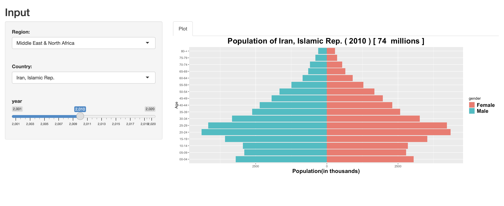

## Introduction
In this demo, I want to plot the age demographics of different countries around the world.
I'm getting the data from [The World Bank](https://www.worldbank.org/en/home) using this [API](https://github.com/gshs-ornl/wbstats)


## Packages

```r
library(wbstats)
library(tidyverse)
library(ggplot2)
```

### Instructions
To run this app on your computer you can simply run this command
```r
require("ggplot2")
require("tidyverse")
library(shiny)
shiny::runGitHub(repo = "zamanisaja/Population-Pyramid")
```

This app will generate something like this
